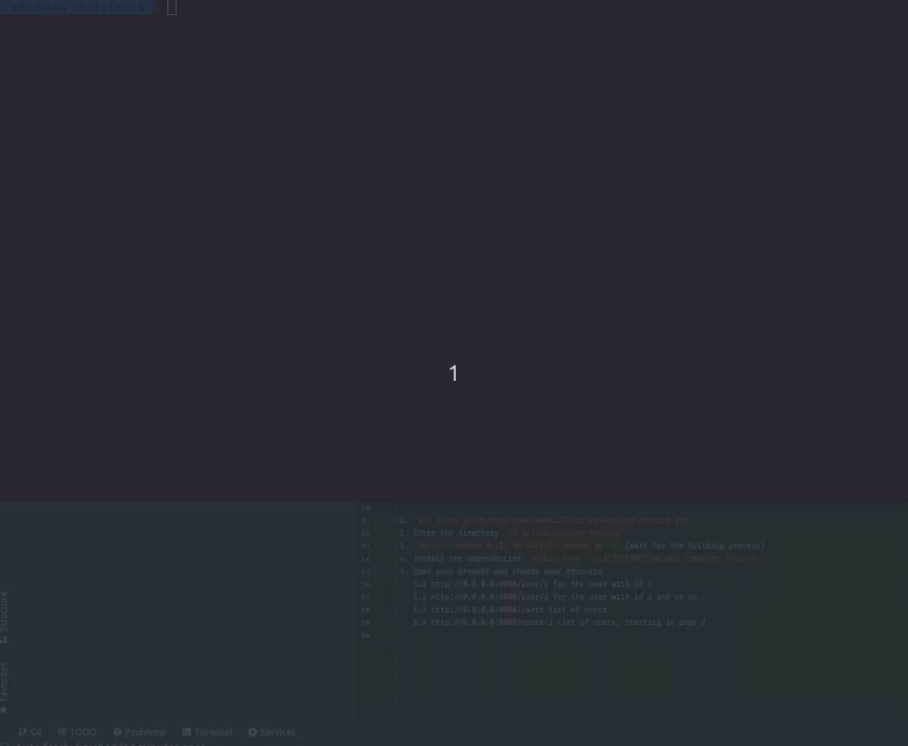

# Active Housing - Interview Task 2022

This is the task requested by Active Housing, which consists of creating a package that:

- Retrieve a user by ID
- Retrieves a list of users
- Convert results to JSON

### You can test this package in two ways:

**Requiring the package**

1. In a blank directory you can create an empty `composer.json` file and paste the following:

```
{
  "name": "other/testing-package",
  "description": "A supper dupper package to fetch data from reqres",
  "type": "project",
  "minimum-stability": "dev",
  "require": {
    "samhk222/active-housing-reqres": "dev-master",
  },
  "repositories": [
    {
      "type": "vcs",
      "url": "https://github.com/samhk222/active-housing-reqres.git"
    }
  ]
}
```

2. then a `composer install`
3. create an `index.php` file, and paste the following

```
<?php
include("vendor/autoload.php");

use Samhk222\ActiveHousingReqres\Models\V1\User;

$cool_user = (new User)->getById(3);
$users = (new User)->getUsers(2);

dd($cool_user, $users);
```

**Using docker**



It's the easiest way, and that way we can test the api in a more interesting way, such as via postman)

1. `git clone git@github.com:samhk222/active-housing-testing.git`
2. Enter the directory `cd active-housing-testing`
3. `docker-compose build && docker-compose up -d` (wait for the building process)
4. Install the dependencies `docker exec -it ACTIVEHOUSING-web composer install`
5. Open your browser and choose your resource   
   5.1 http://0.0.0.0:8080/user/1 for the user with id 1   
   5.2 http://0.0.0.0:8080/user/2 for the user with id 2 and so on..    
   5.3 http://0.0.0.0:8080/users list of users  
   5.4 http://0.0.0.0:8080/users/2 list of users, starting in page 2     
